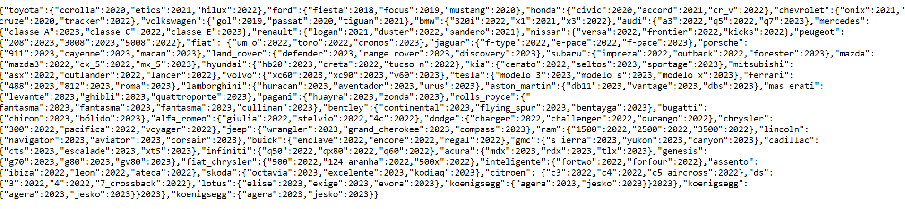

# API de Modelos de Carros

Esta API fornece informações sobre o ano dos modelos de carros de diversas marcas. A API foi desenvolvida utilizando Node.js e Express.js e está hospedada no Vercel.

## Endpoints

- **GET** `/` - Retorna um JSON com as marcas e modelos de carros disponíveis, incluindo o ano de fabricação.

## Acesse o link:

Veja a API em funcionamento: [https://api-models-cars-git-master-elismars-projects.vercel.app](https://api-models-cars-git-master-elismars-projects.vercel.app)

## Resultado da pesquisa:

